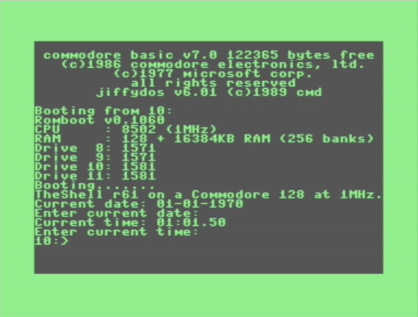

# TheShell128

An MS-DOS like command line interface for the Commodore 128 equipped with at least a Commodore drive and a REU of 256K.

USE THIS PROGRAM AT YOUR OWN RISK!

I'LL NOT BE RESPONSIBLE FOR ANY KIND OF DAMAGE THAT COULD BE CAUSED BY THIS PGM.

## What "TheShell128" can do.
 - Can use 40 cols on VIC or 40/80 cols on VDC;
 - Can set/use CPU in fast or slow mode;
 - Support for fast/slow cpu;
 - Support for REU up to 16MB;
 - Support for aliases;
 - Support for local variables;
 - Support up to 4 drives;
 - Can be localized;
 - Copy or delete files with wildcard support;
 - Rename files (no wildcard support);
 - Format, relabel or copy disk;
 - Show file content;
 - Read or write d64/d71/d81 images;
 - Read directory and copy MS-DOS files with burst support to and from a CBM (no wildcard support, no subdirectories support and only with at least a 1571);
 - Can make an external command resident for the shell;
 - Can execute batch files;
 - Can mount or dismount disk images on UltimateII cart;
 - Can get or put files to a remote host with a simple .js server;
 - Can copy to and from UltimateII cart USB sticks/CBM peripheral;
 - Can get, set or sync the internal clock with the one on the UltimateII cart;
 - Can go back to the shell once gone to basic;
 - Can use any bank of the REU;
 - Can use a (provided) ROM to make it available on cold boot without any disk with an U2 cart

## What "TheShell128" can't do.
Everything not listed in this document! :)

## Files on the disk
| File                       | Description                                        |
|:---------------------------|:---------------------------------------------------|
| BASEXT.BIN                 | Basic extension                                    |
| MSGS.CFG                   | Default English messages                           |
| MSGS-IT.CFG                | Italian messages                                   |
| HELP.HLP                   | Online help                                        |
| LOADER                     | Cold boot loader                                   |
| WARMBOOT                   | Warm boot loader                                   |
| CLB                        | Batch files handler                                |
| CLI                        | Command line interface                             |
| CLE                        | External command handler                           |
| CLP0                       | Command processor                                  |
| CLP1                       | Command processor                                  |
| [ASK](ASK)                 | Ask for a string and set a variable                |
| [BANNER](BANNER)           | Create a banner                                    |
| [CHOICE](CHOICE)           | Wait for a key and set a variable                  |
| [64](64)                   | Load and run a C64 pgm                             |
| [CONFIG](CONFIG)           | Configure various things and create AUTOCONFIG.CFG |
| [DISKCOPY](DISKCOPY)       | Disk copy utility                                  |
| [DXX](DXX)                 | D64/71/81 utility                                  |
| [EXAMCPI](EXAMCPI)         | Examine an MSDOS CPI files for font data           |
| [EXTRACTFONT](EXTRACTFONT) | Extract a font from a CPI file and save it         |
| [FORMAT](FORMAT)           | Format disk utility                                |
| [HELP](HELP)               | Help utility                                       |
| [MKBOOT](MKBOOT)           | Make a disk bootable                               |
| [MSDIR](MSDIR)             | Read an MSDOS disk directory                       |
| [MSVOL](MSVOL)             | Show an MSDOS disk volume informations             |
| [MSREAD](MSREAD)           | Copy a file from an MSDOS disk to a CBM one        | 
| [MSWRITE](MSWRITE)         | Copy a file from a CBM disk to an MSDOS one        |
| [MSTYPE](MSTYPE)           | Show the contents of a file on an MSDOS disk       |
| [VIEWBANK](VIEWBANK)       | Show the contents of a specified bank              |
| [U2UTILS](U2UTILS)         | Ultimate II Cart utility                           |
| [U2XFR](U2XFR)             | Ultimate II Cart transfer utility                  |
| [U2TELNET](U2TELNET)       | Ultimate II Cart ANSI telnet client                |
| [U2FTP](U2FTP)             | Ultimate II Cart FTP client                        |

## How it work
The shell system disk is an autoboot disk, so you can simply insert it into the drive 8: and turn on the c128. 
The program "warmboot.prg" will be loaded and executed automatically, and if it find a previous installation on the REU,
it will resume from there, otherwise will load the "loader.prg" for a cold boot.
The boot process by default will install the shell in the first 4 banks of the REU.

In the beginning of a the cold boot process, TheShell will look for a SEQ file named "autoconfig.cfg".
If found, it will be loaded and parsed for some customization properties.
If you want to skip this file, press the Commodore key while booting.

| Command        | Values          | Description                                             |
|:---------------|:----------------|:--------------------------------------------------------|
| SPEED          | FAST, SLOW      | This set the speed of the cpu                           |
| VIDEOMODE      | VDC, VIC        | This set the video mode                                 |
| COLUMNS        | 40, 80          | This set the video columns                              |
| BORDER         | Color code      | This will set the border color                          |
| BACKGROUND     | Color code      | This will set the background color                      |
| TEXT           | Color code      | This will set the text color                            |
| CLI            | 0-255           | This will set the bank for the CLI                      |
| CLP            | 0-255           | This will set the bank for the CLP                      |
| CLE            | 0-255           | This will set the bank for the CLE                      |
| TMP            | 0-255           | This will set the bank for the TMP                      |
| BANKS          | range           | This will set the banks the can be accessed by TheShell The format for this field is xxx-yyy, where xxx is the lowest bank number and yyy is the highest bank number that TheShell128 can use. For example if you want TheShell128 to use only banks from 10 to 40, you can simply specify BANKS=10-40|

(This customizations will be resumed on every warm boot.)

After loaded all the files, it will look for a SEQ file named "autostart".
This file, just like an autoexec.bat, is a simple batch command that will be executed if found.
If you want to skip this file just press the Shift key while booting.

Once finished loading, you should find yourself in an MS-DOS like environment, with a prompt and a cursor.

Here you can use one of the following internal commands:
| Command              | Description                                                                    |
|:-------------------------|:-------------------------------------------------------------------------------|
| [PROMPT](PROMPT)         | Change the current prompt string;                                              |
| [VER](VER)               | Show the current shell version;                                                |
| [DATE](DATE)	  	   | Set or show the current date;                                                  |
| [TIME](TIME)	  	   | Set or show the current date;                                                  |
| [BREAK](BREAK)	   | Set or show the break flag (used for interrupt batch files);                   |
| [ECHO](ECHO)	  	   | Show the current echo flag or show a string on the screen;                     |
| [ECHO.](ECHO.)	   | Show an empty line;                                                            |
| [COPY](COPY)  	   | Copy files from a drive to another;                                            |
| [SET](SET)		   | Set an environment variable;                                                   |
| [IF](IF) 	  	   | Process a condition;                                                           |
| [HISTORY](HISTORY)       | Show command history;                                                          |
| [CLS](CLS)		   | Clear the screen;                                                              |
| [STATUS](STATUS)	   | Show the current status of a drive;                                            |
| [PAUSE](PAUSE)	   | Make a pause and wait for a key;                                               |
| [DEL](DEL)		   | Delete files (wildcard supported);                                             |
| [TYPE](TYPE)		   | Show the contents of a file;                                                   |
| [RENAME](RENAME)	   | Rename a file (wildcard not supported);                                        |
| [DIR](DIR)		   | Show the directory of a disk;                                                  |
| [CMD](CMD)		   | Send a command to a drive;                                                     |
| [BASIC](BASIC)	   | Go to basic, for go back to the shell, simply write GOBACK, or "go" + SHIFT-B; |
| [VOL](VOL)		   | Show the name of a disk;                                                       |
| [RESIDENT](RESIDENT)     | Make an external command resident in REU;                                      |
| [ALIAS](ALIAS)	   | Create an alias;                                                               |
| [WHY](WHY)		   | Show an explanation for the last error code, if set;                           |
| [EXIT](EXIT)		   | Exit the Shell;                                                                |
| [LABEL](LABEL)	   | Rename a disk;                                                                 |

Anything that contains a blank must be enclosed inside double quotes, so for example, if you want to copy the file 
named "Test file" from the drive 8: to drive 9:, you can write:

COPY "8:Test file" 9:

Or you want to run a program on the current drive named "Test Program", you should write:

"TEST PROGRAM"
	  
If a typed command is not recognized as an internal or resident one, the shell will try to load it from the current drive.

You can specify the type of the file you're referring by adding:
 - P for PRG;
 - S for SEQ;
 - R for REL;
 
so for example if you want to search on a disk for all the SEQUENTIAL files only, you can write something like:

  DIR *,s
  
This command will show only the sequential files.
In the same way you can copy all the sequential files by simply writing:
  COPY *,s 9:

If you want to use a special non printable char, you can print the char $ followed by a 3 digit number indicating 
the ascii code of the character you want to print.

## INTERNAL COMMANDS
### PROMPT
Syntax: PROMPT [string]

This command is used to customize the prompt of the shell.
The prompt will be se to the string passed as parameter, or to "$p$g" if no parameters.

| Code        | Description                                             |
|:------------|:--------------------------------------------------------|
| $G          | Greater than synmbol '>'                                |
| $L          | Less than symbol '<'                                    |
| $P          | Current drive                                           |
| $D          | Current date                                            |
| $T          | Current time                                            |
| $$          | $ symbol                                                |
| $B          | | symbol on CBM charset                                 |
| $Q          | Uqual symbol '='                                        |
| $E          | ESCAPE character                                        |
| $_          | CR character                                            |
| $*          | Blank character                                         |
| $H          | Backspace character                                     |
| $v          | TheShell version                                        |

### VER
Syntax: VER

Show the version of TheShell.

### DATE
Syntax: DATE [date]

Show and set the current date (DD-MM-YYYY).
If no parameters it will ask the current date, and if valid will set it.

### TIME
Syntax: TIME [time]

Show and set the current time (HH:MM.SS).
If no parameters it will ask the current date, and if valid will set it.

### BREAK
Syntax: BREAK [on|off]

Show and set the current break flag.
With this flag on the check for a RUNSTOP/CTRLC will be more sensitive.

### ECHO
Syntax: ECHO on|off|string

Show and set the current echo flag.
If this flag is set the prompt will be shown and in a batch every executed row will be shown on screen.
The echo command will show the string parameter.
If you want to print a non printable character, just insert a $ char and a 3 digit number corresponding to the ASCII code you want to show.
If you want to show an empty row, just write ECHO.

### COPY
Syntax: COPY [drive:]sourcefile drive:[destinationfile][,filetype] [/NR/R/Q/MV]

Copy files from a source disk to a destination disk.

| Code        | Description        |
|:------------|:-------------------|
| /NR         | No replace         |
| /R          | Replace            |
| /Q          | Quiet              |
| /MV         | Move file          |
This command can accept wildcards.

Examples:
 - COPY 8:\*,\*
 - COPY 9:TEST,P 10:TEST,S
 - COPY 10:TEST,S 11:
 - 

### SET
Syntax: SET VARNAME=[VARVALUE]

This command will set an environment variable.
If the value of the variable contains any space, all the parameter must be inside double quotes, so if you want to 
set a variable name "VarName" with a value of "Test value", you should write:

	SET "VarName=Test value"

If you want to refer to any defined variable you should specify a the variable name enclosed inside a '%', so for example,
if you want to copy the file defined in the variable "VarName" to the drive 9:, you should write:

	COPY %VarName% 9:

If you want to clear a variable, you can write something like this:

	SET VarName=

There's some system environment variables that are readonly.

 	RC       	Is the return code of the last command;
	CD		Is the current drive;
	COLS		Is the number of columns of the current display;
	SPEED		Is the current cpu speed;
	VMODE		Is the current video display (VDC or VIC);
 
### IF
Syntax: IF %VARNAME% ==|<>|<|>|NOT EXISTS|EXISTS COMMAND

This command will execute the command if the condition is true.
A space before and after the operator is needed.

### HISTORY
Syntax: HISTORY

This command will show the last 10 commands.

### CLS
Syntax: CLS

This command will clear the screen.

### STATUS
Syntax: STATUS drive:

This command will show the status of the selected drive.

### PAUSE
Syntax: PAUSE

This command will simply wait for a key pressed.

### DEL
Syntax: DEL [drive:]filename [/Y]

This command will delete one or more files, if /Y is specified, no confirm will be asked.
This command can accept wildcards.

### TYPE
Syntax: TYPE [drive:]filename

This command will show the contents of a file.

### RENAME
Syntax: RENAME oldfilename newfilename

This command will rename a file.

### DIR
Syntax: DIR [drive:][wildcard pattern] [/W/P]

| Code        | Description        |
|:------------|:-------------------|
| /W          | Wide format        |
| /P          | Paged format       |

This command will show the directory of a disk according to the wildcard pattern if present.

### CMD
Syntax: CMD drive: drivecommand

This command is used to send a command to a drive.

### BASIC
Syntax: BASIC

This command will take the user to the basic prompt.
If you want to goback to TheShell, simply write GOBACK or GO + ShiftB.

### VOL
Syntax: VOL [drive:]

This command will show the label of the disk in the specified drive.

### RESIDENT
Syntax: RESIDENT [ADD|REMOVE [drive:]filename [/F/NE/NH/O:xxxx/B:xxx/N:NAME/T:TYPE]]

| Code        | Description                       |
|:------------|:----------------------------------|
| /F          | Force the load without confirm    |
| /NE         | Load only if not already resident |
| /NH         | Do not write the header           |
| /O:         | Specify an offset                 |
| /B:         | Specify a bank                    |
| /N:         | Speficy a name                    |
| /T:         | Speficy a type                    |

This command will load any file you specify on a REU bank, or, without any parameter, show the currently resident commands.
When you load a file, if no bank is specified (/B:), TheShell will load the file on the first available bank within the wanted range (if specified in the autoconfig.cfg).

If you try to make resident a pgm with the same name of an already resident one, if no /F is specified TheShell will ask you to confirm the overwrite of the bank.

When TheShell load a file onto a bank, it will write a header on top of the bank, in order to make it recognizable by TheShell.
This can be avoided specifying the /NH flag, but this will prevent TheShell to recognize it, so it will not be show in the list of resident files and could be overwritten by TheShell when looking for an available bank.

The /NE flag is self explanatory, and it will load the file only if not already present.

The /N: flag will specify the name under it will be recognized by TheShell.

The /T: flag is usefull if you want to load a file that is not an executable one, for example the HELP command can use the HELP.HLP file resident on the REU.
 
### ALIAS
Syntax: ALIAS ALIAS=COMMAND

This command make an alias for a command string.  
Keep in mind, that if the alias name or the command has a space inside, all the alias parameter must be enclosed inside double quotes.  
So, for example, if I want to set an alias named "This is an alias" for a command like "dir 8:*,s", I should write at the prompt:

	alias "This is an alias=dir 8:*,s"

You can also write:

	alias "pdir=dir /p"
	alias "wdir=pdir /w"
	alias wpdir=wdir
	
and then for example at the prompt with "wpdir 8:", you should see a wide paged directory listing of the drive 8:.

### WHY
Syntax: WHY

This command will show the last error code set by the last executed command.

### EXIT
Syntax: EXIT [/Y] [/D] [/64]

The flag /D is for invalidate the current installation on the REU.
the flag /64 for go directly to 64 mode.
This command will exit TheShell and reboot the computer, if /Y is specified, no confirmation will be asked.

### LABEL
Syntax: LABEL drive: label

This command will relabel a disk.

## EXTERNAL COMMANDS
### ASK
Syntax: ASK varname length

This command is used for ask the user for a value with a max length of "length" and set a variable "varname" with the received value.

### BANNER
Syntax BANNER "text" /CS:A|G

This command will print on the screen the text received in input with the current font set for the VDC display.
The option /CS will set the charset to use, A for alphanumeric and G for graphic.
If you change the font with the "CONFIG" command the banner should reflect the loaded font.

### CHOICE
Syntax: CHOICE varname

This command will wait for a key and set the variable "varname" with the pressed key.

### 64
Syntax: 64 [filename] [/CD][/NS]

With this command you can run a C64 executable directly from the shell.
If only a unit name is passed the first program on that unit will be executed, otherwise the specified one.
So, for example:
	64 10:
	Will do a LOAD"*",10,1
	64 9:TEST
	Will do a LOAD"TEST",9,1

The flag /CD will software change the unit of the filename to the drive 8: .
	64 10: /CD
	Will software swap the drive 10: with the 8: and do a LOAD"*",8,1
	64 9:TEST /CD
	Will software swap the drive 9: with the 8: and do a LOAD"TEST",8,1
	
The flag /NS will not specify a secondary address on the load command.
	64 10: /NS
	Will do a LOAD"*",8
	64 9:TEST /NS
	Will do a LOAD"TEST",9

### CONFIG
Syntax: CONFIG action option [/R]

This command is used to configure various things.

|Action              |Option         |Description                       |
|:-------------------|:--------------|:---------------------------------|
|SCR                 |VIC            |40 Columns on VIC display         |
|                    |VDC40          |40 Columns on VDC display         |
|                    |VDC80          |80 Columns on VDC display         |
|CPU                 |FAST           |CPU in fast mode                  |
|                    |SLOW           |CPU in slow mode                  |
|COLOR               |color code &nbsp;&nbsp;&nbsp;&nbsp;|Will change the current text color|
|BACKGROUND          |color code     |Will change the background color  |
|BORDER              |color code     |Will change the border color      |
|FONT                |font name      |Will load the font for the VDC display|
|                    |               |Because of how the charset are organized, you can specify a range of chars to be loaded and where to load them in the VDC. For example, if you want to load only the chars from 69 to 100 and load them on the vdc from the char 32, you write: CONFIG FONT TEST.FNT 69-100 32    |
|LANG                |msg file       |Will change the current defined messages|
|CFG                 |SAVE           |Will save a configuration file    |
|                    |LOAD           |Will load a configuration file    |
|DRIVES              |ADD            |You can add a drive with: CONFIG DRIVES ADD 8: 15[4/7/8]1 Or you can write: CONFIG DRIVES ADD AUTO In this way TheShell will try to detect any new drive|
|                    |REMOVE         |You can remove a drive with: CONFIG DRIVES REMOVE 8:           |

The flag /R is used only with the CFG SAVE for overwrite the config file if existing.

### DISKCOPY
Syntax: DISKCOPY source destination

This command will copy a disk from the source drive to the destination drive.
The drive type must be compatible, you can't copy a 1581 disk to a 1571 or 1541 drive.

### DXX
Syntax: DXX source destination

This command is used to create an image or a floppy disk.
The source parameters can be an image file or a disk drive.
If the source is a disk drive the destination must be an image file.
If the source is an image file the destination must be a disk drive.
The image type is extracted from the image file name, so the must end with a .d64/.d71/.d81

### EXAMPCPI
Syntax: EXAMCPI cpifile

This command is used to inspect an MSDOS CPI file for font data.
As far as I've seen there are more variants of this file, so if the CPI file is in the right format, you should see a list of the contained fonts, which can be extracted by the EXTRACTFONT command and used with the CONFIG FONT command.

### EXTRACTFONT
Syntax: EXTRACTFONT cpifile codepage fontnumber

This command is used for extract a specific font for a specific codepage from an MSDOS cpi file.
If the command find the codepage and the fontnumber in the cpi file, it will create a ".CHR" file with the specified font data.

### FORMAT
Syntax: FORMAT drive [name] [id] [/SS][/NS][/Y][/Q][/S]

This command is used for format a disk.
If not specified the name and the id, they will be requested by the program.
The /SS flag is used for format a single sided floppy on a 1571.
The /NS flag is used to prevent the format to allocate the boot sectors, by default the sectors are reserved.
The /Y flag is used to make the format starts immediately.
The /Q flag is used to make a quick format that will clean only the allocation table.
The /S flag is used to prevent the program to output anything on screen.

### HELP
Syntax: HELP string /B:bankId|/f:fileName

This command will search the "string" in the specified bank or in the specified file.
You can load the provided help file on a bank and than use it with this command to view it's contents.

### MKBOOT
Syntax: MKBOOT drive [/Q]

This command will make a disk autobootable for TheShell.
The /Q is for prevent any output.

### MSDIR
Syntax: MSDIR drive [/P]

This command is used to show the directory of an MSDOS disk.
The /P will page the content.
Only with a 1571/1581 drive.

### MSVOL
Syntax: MSVOL drive

This command is used to show the volume name of an MSDOS disk.
Only with a 1571/1581 drive.

### MSREAD
Syntax: MSREAD MSfilename CBMfilename

This command will copy a file from an MSDOS disk to a CBM one.
Only with a 1571/1581 drive.

### MSWRITE
Syntax: MSWRITE CBMfilename MSfilename

This command will copy a file from a CBM disk to an MSDOS one.
Only with a 1571/1581 drive.

### MSTYPE
Syntax: MSTYPE filename [/P]

This command will show the contens of a file on an MSDOS disk.
The /P will page the content.
Only with a 1571/1581 drive.

### VIEWBANK
Syntax: VIEWBANK bankId [start address]

This command will show the contents of a bank on the REU.
If wanted it can start from a specified address.
With 'n' you will jump to the next page.
With 'p' you will jump to the previous page.
With 'h' you will jump to the beginning of the bank.
With 'g' you can jump to a specific address.
With 'q' you will quit from the command.

### U2UTILS
Syntax: U2UTILS action [parameters]

|Action          |Explanation                                       |
|:---------------|:-------------------------------------------------|
|ID              |Show the cart ID                                  |
|DIR             |Show the directory of on the U2                   |
|                |U2UTILS DIR /                                     |
|                |U2UTILS DIR /USB0                                 |
|CD              |Change the current directory on the U2            |
|                |U2UTILS CD /USB0                                  |
|COPY            |Copy from to and from U2/CBM.                     |
|                |U2UTILS COPY 8:TEST.D64 /USB0                     |
|                |U2UTILS COPY /USB0/TEST.D64 8:                    |
|CREATE          |Create an image.                                  |
|                |U2UTILS CREATE /USB0/TEST.D64                     |
|DEL             |Delete a file on the U2                           |
|                |U2UTILS DEL /USB0/TEST.D64                        |
|MOUNT           |Mount an image on an U2 drive                     |
|                |U2UTILS MOUNT 10: /USB0/TEST.D64                  |
|UMOUNT          |Unmount an image from an U2 drive                 |
|                |U2UTILS UMOUNT 10:                                |
|TIME GET        |Will show the current time on the U2              |
|TIME SET        |Will set the current date/time on the U2          |
|                |U2UTILS SET 2024/01/01 01:01:00                   |
|TIME SYNC       |Will sync the date and time with the one on the U2|
|TIME SYNC DATE  |Will sync the date with the one on the U2         |
|TIME SYNC TIME  |Will sync the time with the one on the U2         |
|REU             |Will load or save the REU content to a file on the U2|

### U2XFR
Syntax: U2XFR hostname port action parameters

This command is used to transfer files from a pc using the ethernet interface of the U2.

|Action          |Explanation                                          |
|:---------------|:----------------------------------------------------| 
|GET             |Copy a file from the pc to the CBM                   |
|                |GET C:\TEMP\TEST.D64 /USB0                           |
|                |GET C:\TEMP\TEST.D64 8:                              |
|PUT             |Copy a file from the CBM to the PC                   |
|                |PUT 8:TEST.D64 C:/TEMP/                              |
|DXX             |Will directly write an image from a PC to a CBM drive|
|                |DXX C:/TEMP/TEST.D64 8:                              |
|DIR             |Will show the content of a remote directory on the PC|
|                |DIR C:/TEMP                                          |

### U2TELNET
Syntax: U2TELNET hostname port [/VARLIST:varname^varvalue^varname^varvalue...][/ROWS:rows][/COLS:cols][/DEBUG][/Q]

This is a simple telnet client, if specified a varlist, they will be sent to the server.
The client will present itself as an ansi terminal.
The /ROWS and /COLS will specify the rows and columns of the terminal, if not specifed the client will set it according to the current screen size.
The /DEBUG will print some debug informations that can be usefull in case of issues.

### U2FTP
Syntax: U2FTP hostname port [/Q]

This is an FTP client.

## U36 ROM Loader
If you want to warm boot directly to TheShell when you power or reset on you C128, you've to burn the provided ROM to a 27C256 eprom.
The ROM contains a combined version of the loader and wamboot, that will cold boot or warm boot to TheShell.

Once the ROM is installed, you can:
 - Power on or reset the C128 while pressing a key from 1 to 4 (corresponding to drive 8 to 11) for a cold boot of TheShell from the selected drive.
 - Power on or reset the C128 while pressing the shift key to prevent a warm boot to TheShell if present on the REU.

If you power on or reset the C128 with TheShell loaded on the REU without pressing any of the above key, the ROM will take you directly to TheShell prompt, preserving all the aliases and vars.

If you've an Ultimate II cart, you can, once loaded TheShell on the REU, save the REU content, and set the image just saved for preload.
This will make TheShell available even after a cold boot.
You could notice a small delay between the power on and the start of TheShell, this is because (I believe) the preloaded image of the REU take some times to be available.
